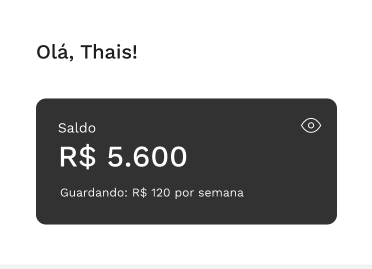
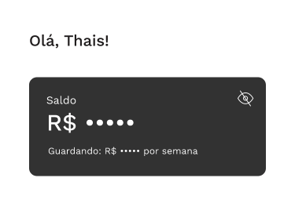

# Mobile Engineer Test

Este repositório serve como case para avaliação técnica para a posição de mobile

## Case

Na Monis nós trabalhamos com _user story_ para definir as melhorias do nosso produto; Este case é um exemplo de um card com uma "nova feature" para o nosso produto. Você reescreverá "parte" do nosso sistema 😁

### Story #: Criar card de saldo do usuário

**Notas**:

- Nossos usuários possuem assinaturas que debitam semanalmente de seus cartões de crédito;
- Esses débitos compoem o saldo do usuário;
- Cada débito tem um rendimento de 100% do CDI;

**Critérios de Aceite**

- Não se preocupe em ser _pixel perfect_, o objetivo é avaliar código e organização, fique a vontade para mudar cores, fonts e etc;
- O card deve ser acompanhado de uma saudação + primeiro nome do usuário;
- O card deve exibir o saldo em BRL;
- O card deve exibir qual o valor semanal da assinatura;
- O card deve ter a funcionalidade de esconder e exibir os valores;
- O card deve ter como default os valores escondidos;
- Ao clicar em qualquer parte do card ele deve mudar o estado de exibição dos valores;

## Recursos

- Utilize o `balance.json` como mock de dados;
- Para referência foi usada a fonte WorkSans (Google Fonts);
- Exemplo de card com valores visíveis:  
  
- Exemplo de card com valores não visíveis:  
  
